# Current Tutor Dashboard Architecture

Updated September 29, 2026. These diagrams describe the implemented project, including the separate purchased and completed class counts.

Sources: [App.jsx](../src/App.jsx), [main.jsx](../src/main.jsx), [layout](../src/Components/layout/), [Students](../src/Components/Students/), and [lessons](../src/Components/lessons/). Folder names preserve the repository's capitalization.

## 1. Overall React app architecture

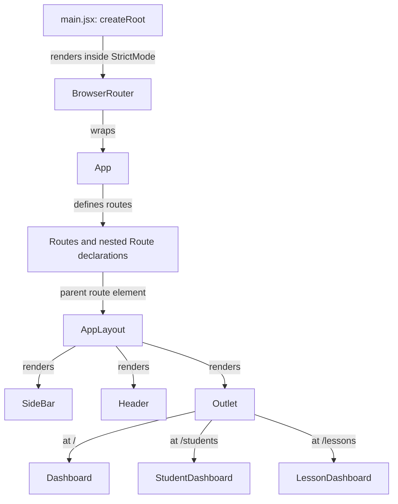

**What to understand:** The sidebar and header belong to `AppLayout`. The matched child page appears in `Outlet`; the three page arrows are alternatives, not simultaneous pages. The shared `Header` still displays the fixed title "Dashboard". `App` supplies data directly to route elements rather than passing it through `AppLayout`.

## 2. Component relationships

### Students

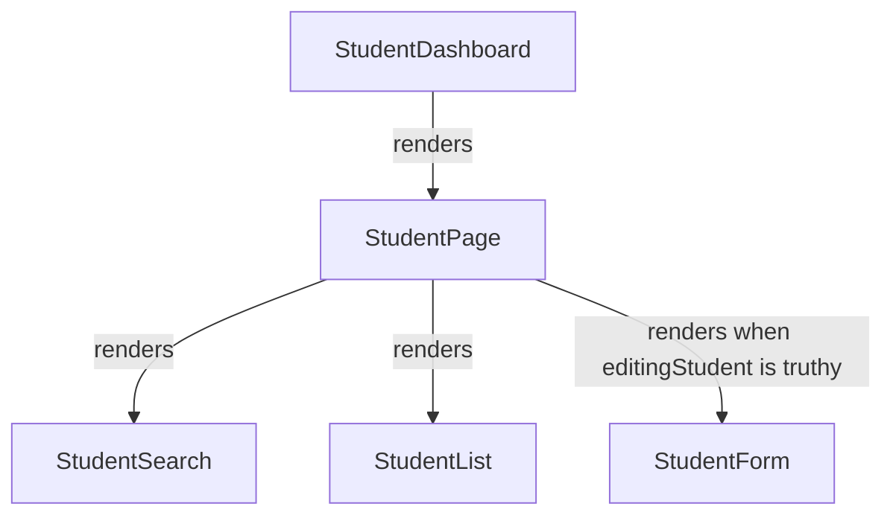

**What to understand:** `StudentDashboard` provides the page heading and wrapper. `StudentPage` coordinates the form, list, and search. Add/Edit opens the form by setting a draft; Save/Cancel clears the draft and hides it.

### Lessons

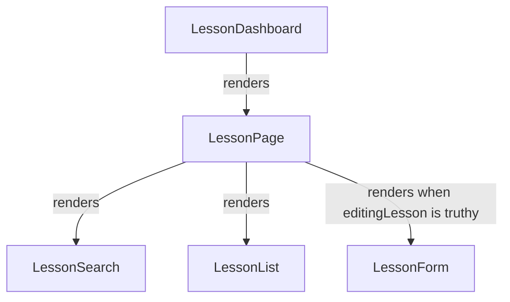

**What to understand:** Lessons follows the same structure. `LessonForm` is now connected, and Add/Edit opens it. The page owns handlers; the form and list call them through props. `StudentCard.jsx`, `Common/Button.jsx`, and `Common/EmptyState.jsx` remain empty files and are not rendered components.

## 3. State ownership

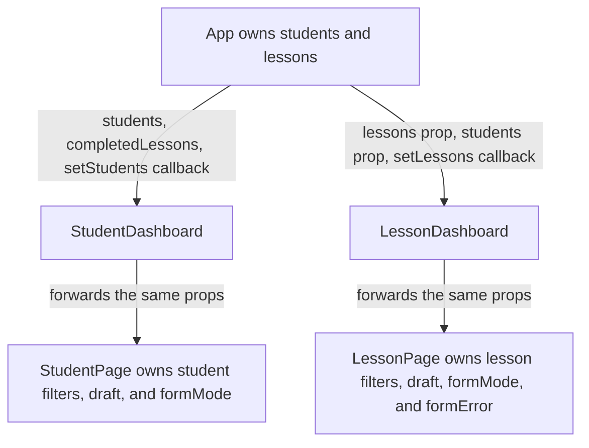

**What to understand:** Shared arrays remain in `App`; temporary filters and drafts remain in the feature pages. The dashboard wrappers only forward props. `completedLessons` is calculated from `lessons`, not stored as another state array.

| Owner | State | Initial value / use |
| --- | --- | --- |
| `App` | `students` | Saved students converted to the current field names, or default students. |
| `App` | `lessons` | Saved lesson records, or an empty array. |
| `StudentPage` | `search`, `level`, `course` | Empty search; `All` filters. |
| `StudentPage` | `editingStudent`, `formMode` | Both `null` until Add/Edit. |
| `LessonPage` | `search`, `status`, `date` | Empty search/date; status `All`. |
| `LessonPage` | `editingLesson`, `formMode`, `formError` | Null draft/mode and empty error message. |

The forms, lists, search components, and dashboard components do not own additional state. Page-local state resets when the page unmounts. The shared arrays stay in `App` while navigating.

## 4. Purchased classes and completed classes

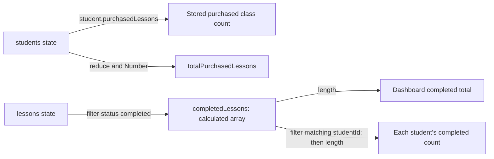

**What to understand:** Purchases and completions measure different things. `purchasedLessons` is an editable, stored number on each student. Completed classes are actual lesson records marked `completed`. The app calculates their count whenever it renders; it does not save a duplicate completed counter on students.

| Value | Source | How it changes |
| --- | --- | --- |
| Purchased classes per student | `student.purchasedLessons` | Edit the student's Purchased classes input. |
| Purchased classes total | Sum of students' `purchasedLessons` | Updates when student records change. |
| Completed classes total | `completedLessons.length` | Updates when lesson records or statuses change. |
| Completed classes per student | Completed lessons with matching `studentId` | Updates on completion, reassignment, or deletion. |
| Upcoming total | Lessons whose status is `upcoming` | Updates on lesson changes; this is status-based, not a clock/date calculation. |

Completing a lesson does not subtract from purchased classes. Changing it back to `upcoming` or `cancelled`, or deleting it, removes it from completed counts. Reassigning a completed lesson changes the per-student counts without changing the overall completed total. There is no purchase-limit or remaining-balance rule.

## 5. Props down and callbacks back to state owners

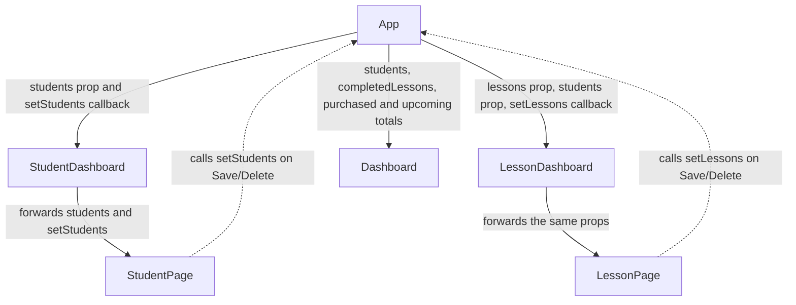

**What to understand:** Functions are passed down as props. Dotted arrows represent the child calling those functions, which update state in `App`. React then renders updated values. A student purchase edit and a lesson status edit both update Dashboard through the same state-owner pattern.

## 6. localStorage and older student records

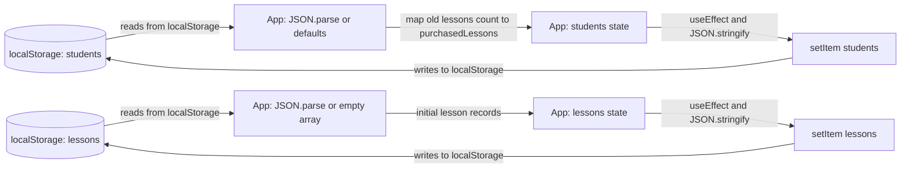

**What to understand:** Both collections use their existing separate storage keys. Effects run after mounting and when the associated state changes. The student effect also persists the converted field name. No new localStorage key is needed for purchased classes because the number is part of each student object.

The initialization conversion in `App.jsx`:

1. Reads saved students, or uses the default list if the key is missing.
2. Keeps each student's ID, name, age, country, course, and level.
3. Uses an existing `purchasedLessons` value if present, including zero.
4. Otherwise carries the old `student.lessons` count into `purchasedLessons`, using zero when no old count exists.
5. Converts that value with `Number()` and leaves the old student `lessons` field out of the new object.

For example, an old student count `lessons: "30"` becomes `purchasedLessons: 30`. No historical lesson records are invented. Completed counts depend only on the existing lesson records.

These expressions execute in the component body, but `useState` only takes the initial value on mount. The code currently assumes valid saved JSON and array-shaped data. localStorage is persistence, not an additional React state owner.

## 7. Students feature architecture

### Search, table, and class counts

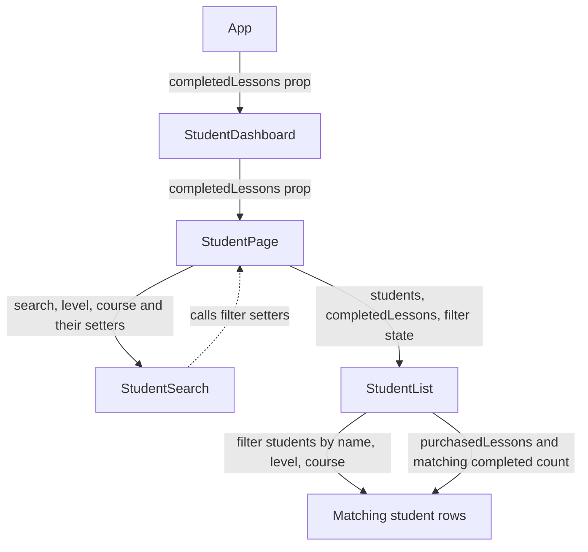

**What to understand:** Search/filter state stays in `StudentPage`. The list reads purchased classes directly from each student and counts matching records from the `completedLessons` prop. String conversion on both IDs allows numeric and string IDs to match. The table has nine columns, including separate Purchased classes and Completed classes columns.

### Student forms and updates

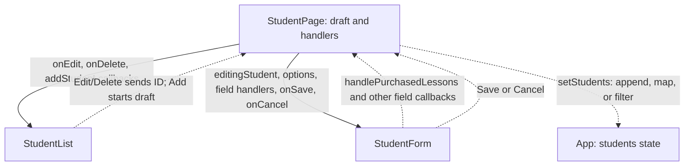

**What to understand:** Purchased classes are edited through `handlePurchasedLessons`, just like other student fields. The input allows nonnegative whole numbers, keeps an empty string while cleared, and converts nonempty input to a number. New students start with zero purchased classes. Completed classes have no editable form input because they come from lesson statuses. Save updates the shared array; Cancel discards the draft.

Student records now contain `id`, `name`, `age`, `country`, `course`, `level`, and `purchasedLessons`.

## 8. Lessons feature architecture

### Search and filtering

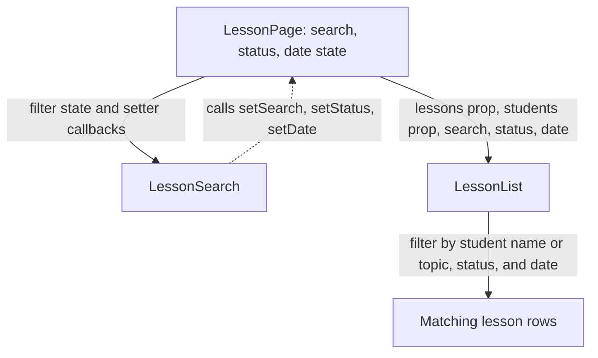

**What to understand:** Search matches student names or topics without case sensitivity. Status `All` and an empty date bypass their respective filters. All active filters must match. `filteredLessons` is calculated during rendering. The list distinguishes "No lessons yet" from "No lessons found".

### Add, Edit, Save, Cancel, and Delete

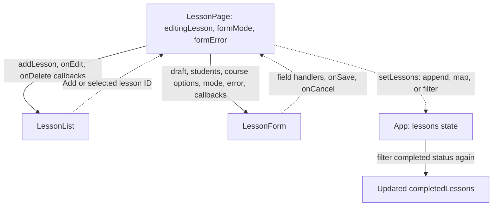

**What to understand:** Add creates a draft; Edit uses `find` to load one. Form changes update the draft through page handlers. Save validates that the student exists, then appends a generated ID in Add mode or replaces the matching record in Edit mode. Edit preserves the lesson ID. Cancel changes no saved data. Delete removes the record and closes the form if that record was being edited.

`LessonForm` has required student, date, time, status, and course fields; topic is optional. It shows Add/Edit headings and an error message when supplied. With no students, Save is disabled. Status choices are `upcoming`, `completed`, and `cancelled`; `All` belongs only to the search filter.

Lesson records contain `id`, `studentId`, `date`, `time`, `topic`, `status`, and `course`. They do not store purchased-class counts.

### Student lookup

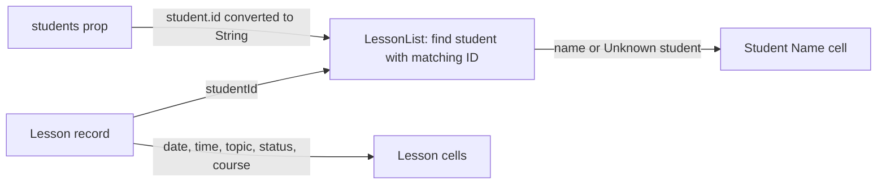

**What to understand:** The name comes from the current student record; the remaining lesson details come from the lesson itself. Both IDs are compared as strings. Editing a lesson with a missing student clears its selection so a valid student must be chosen before saving.

Student deletion currently removes only the student, not their lesson records. Such rows display "Unknown student". Completed records for missing students still count toward the global completed total but do not appear under a current student's total. The app does not currently block student deletion or preserve student identities against ID reuse.

## 9. Dashboard calculations

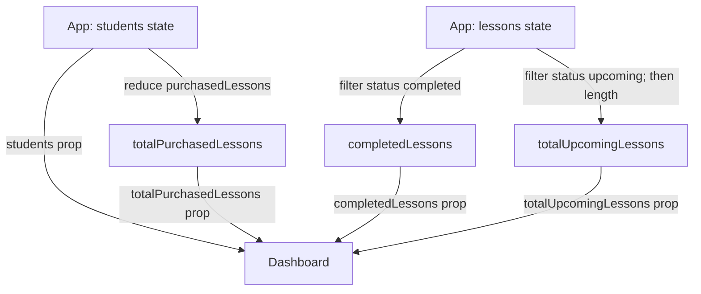

**What to understand:** Dashboard receives the arrays and calculated values it displays. It has four summary cards: Students, Purchased classes, Completed classes, and Upcoming. Student class totals below the cards use the actual student names, purchased values, and per-student completed counts. The former hardcoded Recent Students cards and Upcoming value have been removed. Counts are not separately stored in state or localStorage.

## 10. Routing architecture

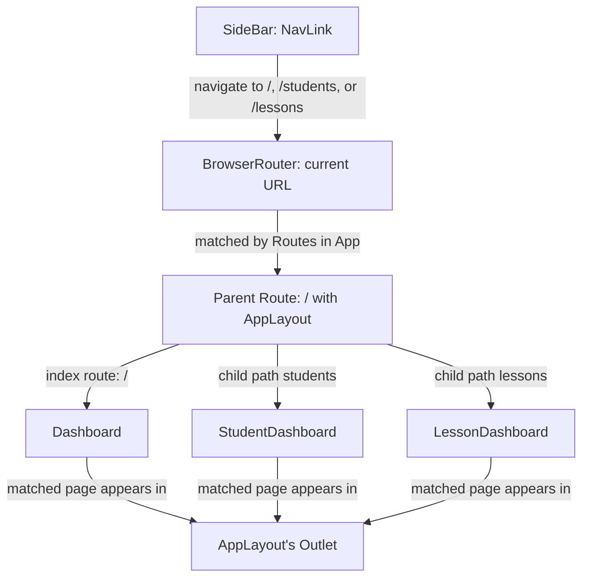

**What to understand:** This shows route matching, not component ownership. `AppLayout` renders `Outlet`; pages do not render it themselves. Add/Edit forms remain inside their feature pages and do not have separate URLs. The root sidebar link uses `end` to match only the root path.

## How to read this architecture

### What is a parent component?

A parent renders another component in its JSX. `StudentPage` renders `StudentForm`, so it is that form's parent. An imported file is not necessarily rendered; follow the arrows labeled "renders" to see actual relationships.

### What owns the state?

The component declaring `useState` owns that state. `App` owns the saved arrays, while the feature pages own drafts and filter values. Receiving props does not create a second state owner. `completedLessons` is a calculation, not a third shared state array.

### How does data flow?

Data and callback functions travel down as props. Solid arrows label what is passed or rendered. Dotted arrows show a child calling a received callback. Calculations use `filter`, `map`, `reduce`, and array lengths, just as the existing features do.

### How do routes connect to pages?

`BrowserRouter` provides the routing context. `App` maps URLs to page elements. `AppLayout` places the matched page inside `Outlet` while keeping its shared sidebar and header.

### How do children communicate with parents?

For example, a lesson row calls `onEdit` with an ID. `LessonPage` loads the draft; `LessonForm` sends field changes back through callbacks. Save calls `setLessons`, updating the state in `App`. App's effect saves the array, and its completed-class calculation updates the Dashboard and Students props. No child directly mutates the parent's array.
